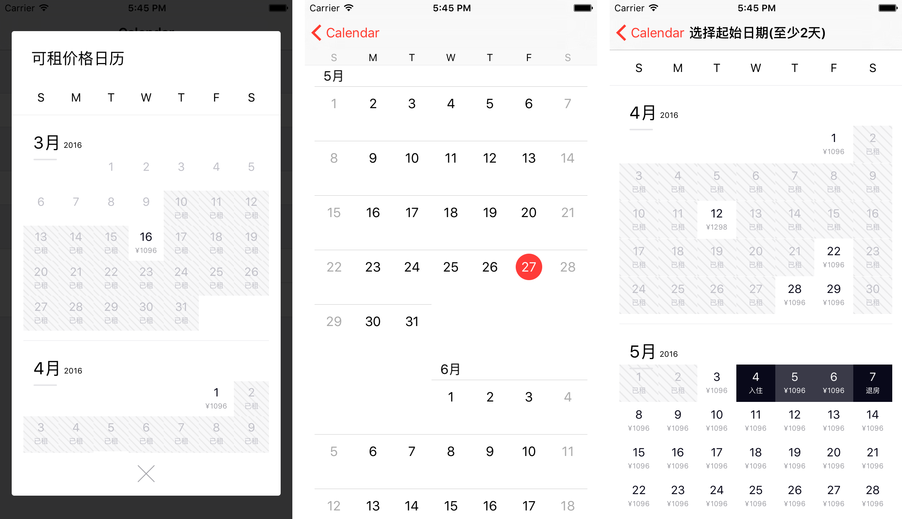

## ZBJCalendar     

> ZBJCalendar is a simple way to create a calendar view. The concept of ZBJCalendar is UICollectionView or UITableView.

> As we know, UICollectionView and UITableView set up the corresponding relations between cell and indexPath. Differently, ZBJCalendar set up the corresponding relations between cell and date, this is important to understand ZBJCalendar.

## Requirements

 * iOS7 or later

## Installation with CocoaPods
`pod 'ZBJCalendar'`

## Installation with Carthage
`github "wanggang316/ZBJCalendar"`

## Architecture

### ZBJCalendarView

This is the main class of ZBJCalendar, an instance of this is a calendar view.

You can find some familiar properties and new properties:

 * `dataSource` is `<ZBJCalendarDataSource>` protocol property which  used to custom cells or headers
 * `delegate` is `<ZBJCalendarDelegate>` protocol property which used to handle the display and behaviour of the day cells.
 * `firstDate` and `lastDate` use to set the calendar's start date and end date.
 * `selectionMode` is a enum of `ZBJSelectionMode` which express the single selection or mutable selection or can't be select.

Also, it contains some familiar methods like:
 * `- (void)registerCellClass:(id)clazz withReuseIdentifier:(NSString *)identifier;`
 * `- (void)reloadData;`
 * `- (id)cellAtDate:(NSDate *)date;`
 * `- (void)reloadCellsAtDates:(NSSet<NSDate *> *)dates;`

#### <ZBJCalendarDataSource>

A protocol to custom the cell data model object. It supplies the cell and supplementary view's information about appearance and data.

* `- (void)calendarView:(ZBJCalendarView *)calendarView configureCell:(id)cell forDate:(NSDate *)date;`
* `- (void)calendarView:(ZBJCalendarView *)calendarView configureSectionHeaderView:(id)headerView firstDateOfMonth:(NSDate *)firstDateOfMonth;`
* `- (void)calendarView:(ZBJCalendarView *)calendarView configureSectionFooterView:(id)headerView lastDateOfMonth:(NSDate *)lastDateOfMonth;`
* `- (void)calendarView:(ZBJCalendarView *)calendarView configureWeekDayLabel:(UILabel *)dayLabel atWeekDay:(NSInteger)weekDay;`

#### <ZBJCalendarDelegate>

A protocol use to handle the display and behaviour of ZBJCalendar.

* `- (BOOL)calendarView:(ZBJCalendarView *)calendarView shouldSelectDate:(NSDate *)date;`
* `- (void)calendarView:(ZBJCalendarView *)calendarView didSelectDate:(NSDate *)date ofCell:(id)cell;`

### ZBJCalendarWeekView

ZBJCalendar provider a week view by this class, you can change it's style by implement <ZBJCalendarDataSource>

### NSDate+ZBJAddition

This category provide utility methods for `NSDate`.

### NSDate+IndexPath

 This category provide methods used to corresponding relations between indexpath and date.

## Examples

## License

ZBJCalendar is released under the MIT license.
